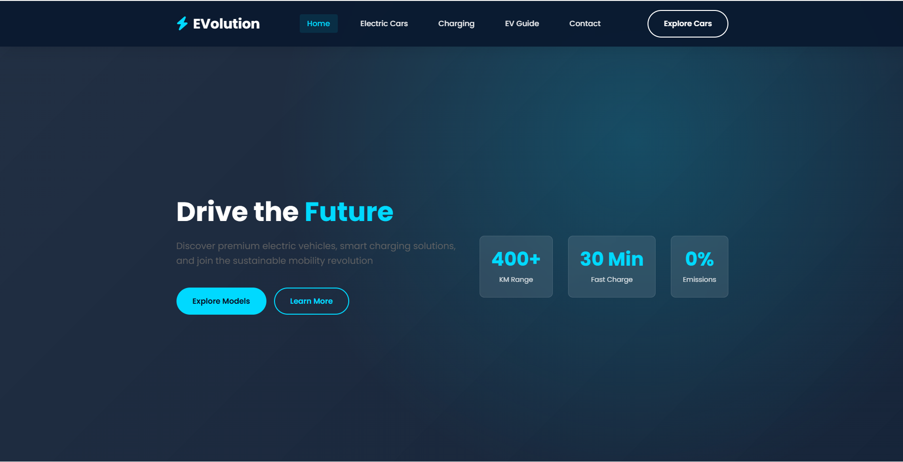
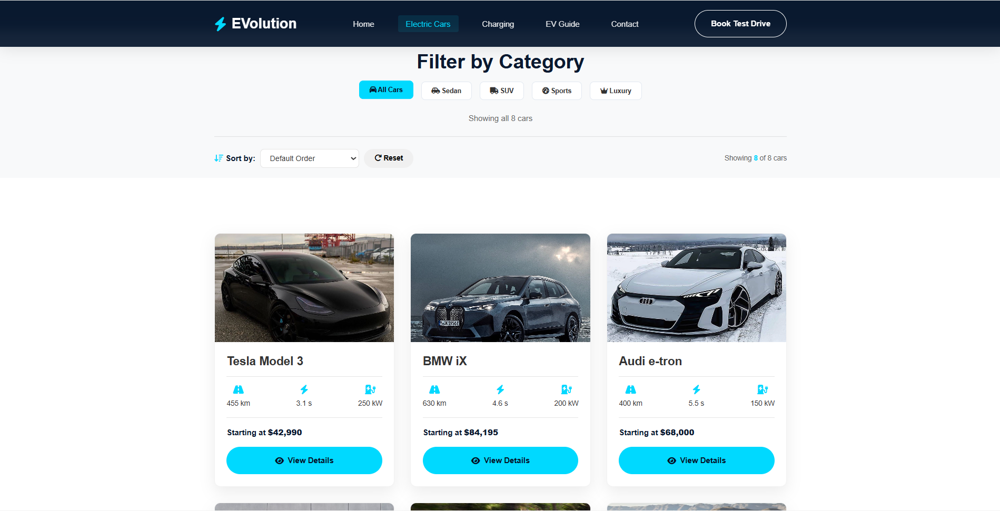
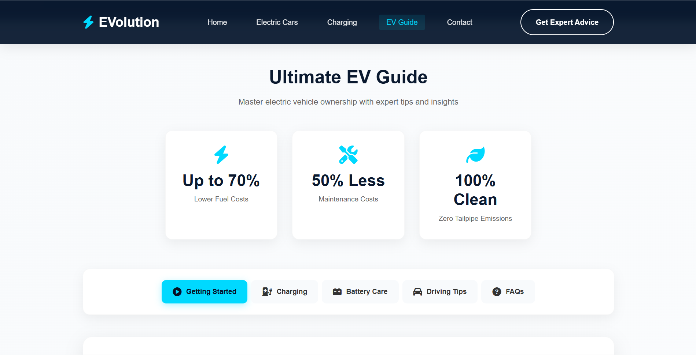
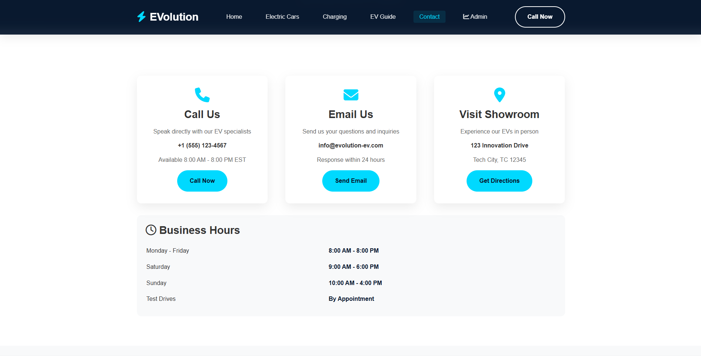

# Electric Cars Website

A multi-page frontend website focused on electric vehicles.  
The project provides car listings, detailed car pages, charging information, tips for EV users, and an admin panel UI.

## 🚀 Live Demo
(Will be added after enabling GitHub Pages)

## 🛠️ Technologies Used
- HTML5
- CSS3
- JavaScript (Vanilla JS)

## 📌 Features
- Electric car listings
- Car details page
- Charging calculator
- EV tips and guides
- Contact form
- Admin dashboard UI
- Responsive design

## 📂 Project Structure

assets/
├─ css/
├─ js/
├─ car-images/
├─ pdfs/

## 📷 Screenshots
### Home Page

### Cars Page

### Car charging page

### Car Tips Page

### Car contact page

## 👨‍💻 Author
Mahmoud Riizk

## 📄 License
This project is for educational purposes.
